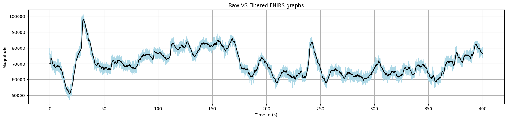

# ** Time Series Analysis and Modeling**
 This is a course project done uder the requirements of AM5510-IITM.
 The ami of this project is to unerstand time series data and use techinques to analyse it and then model it using statistiacal methods tought in the class.

